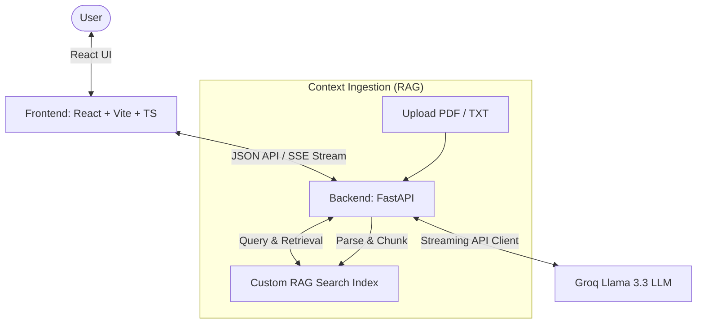

# Aura Agent: High-Performance React + FastAPI Chatbot Sandbox

A premium, recruiter-ready AI Chatbot web sandbox featuring real-time stream responses, a custom zero-dependency Retrieval-Augmented Generation (RAG) search index, and a modern glassmorphic interface.

Designed to showcase modern software engineering best practices, microservice architectures, and custom semantic text retrieval implementations.

## 🚀 Key Features

* **⚡ Lightning Fast Streaming**: Uses Server-Sent Events (SSE) from a Python backend to stream LLM responses token-by-token.
* **🔍 Custom In-Memory RAG Engine**: Pure Python TF-IDF Vectorizer and Cosine Similarity search index. No database configurations needed—chunking, indexing, and matching happen dynamically in memory.
* **🎙️ Voice Dictation**: Integrated native web browser Speech-to-Text API for hands-free queries.
* **🎨 Glassmorphic Interface**: A bespoke frontend styled with pure CSS (no bloated frameworks) using backdrop blur effects, neon gradient glows, and smooth responsive transitions.
* **⚙️ Decoupled Architecture**: Separation of concerns between a React + TypeScript SPA frontend and a FastAPI backend service.

---

## 🛠️ Architecture & Data Flow



---

## 💻 Tech Stack

* **Frontend**: React 18, Vite, TypeScript, Lucide Icons, Marked (Markdown Parser).
* **Backend**: FastAPI, Uvicorn, LangChain-Groq, python-dotenv, PyPDF (for PDF context extraction).
* **Styling**: Vanilla CSS3, Google Fonts (Outfit, Inter, Fira Code), CSS variables.

## ⚙️ Quick Start

### 1. Setup

1. **Clone the repository**:
   ```bash
   git clone https://github.com/Acacia30-P/Aura-agent-chatbot.git
   cd Aura-agent-chatbot
   ```

2. **Configure Backend dependencies & key**:
   - Install Python virtual environment packages:
     ```bash
     python3 -m venv venv
     source venv/bin/activate
     pip install -r backend/requirements.txt
     ```
   - Set your Groq API key in the `.env` file inside the `backend` folder:
     ```env
     GROQ_API_KEY=your_groq_api_key_here
     ```

3. **Configure Frontend node packages**:
   ```bash
   cd "Aura agent"
   npm install
   cd ..
   ```

### 2. Start Application

Simply run the unified startup script from the root directory:
```bash
python3 run.py
```

This single command automatically launches:
* The FastAPI backend server on [http://127.0.0.1:8000](http://127.0.0.1:8000)
* The Vite React frontend dev server on [http://localhost:5173](http://localhost:5173) (requests are automatically proxied to the backend).

To stop both servers at any time, just press `Ctrl + C` in the terminal.

---

## 💡 Code Highlights for Recruiters

* **Zero-Dependency Vector Search**: In `backend/rag_engine.py`, the tokenization, stop-word removal, TF-IDF weights, L2 normalization, and cosine-similarity computations are coded in pure Python to demonstrate strong mathematical foundations of information retrieval.
* **Low-Latency Streaming**: Standard HTTP streaming in `backend/main.py` sends text tokens instantly from Groq to the client, providing a fluid user experience.
* **Type-Safe Frontend**: Written in TypeScript using React functional components, hooks, and clean state management.
